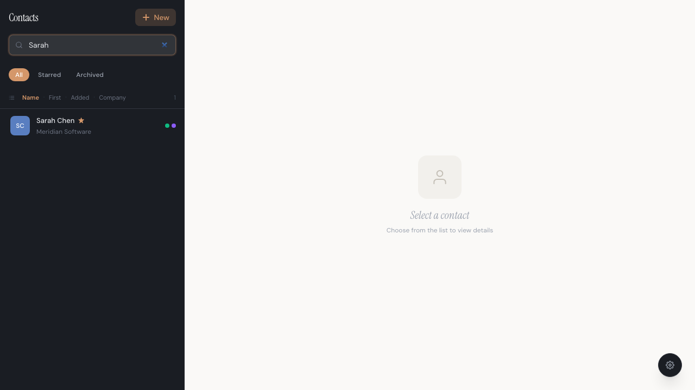
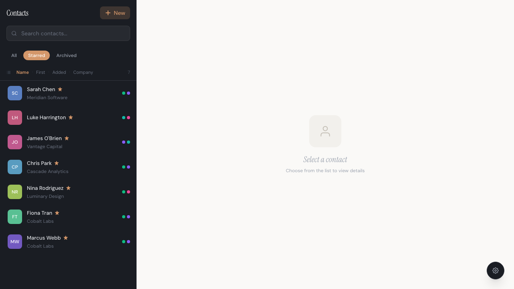
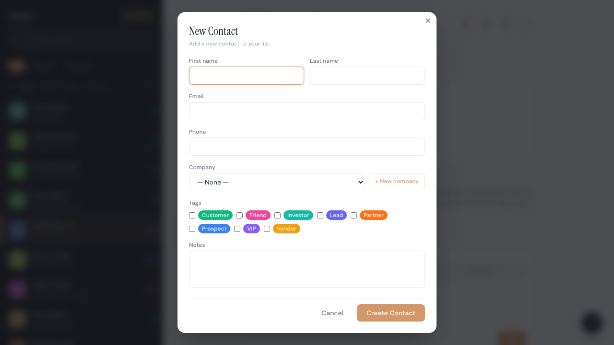
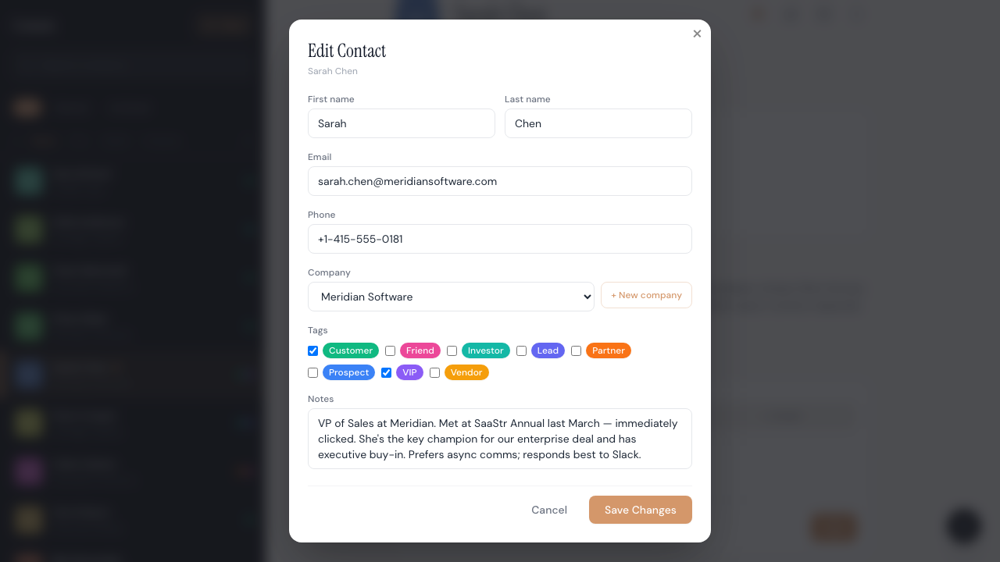
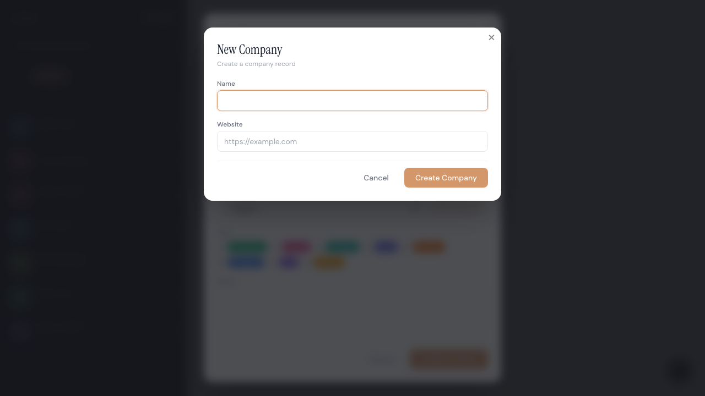
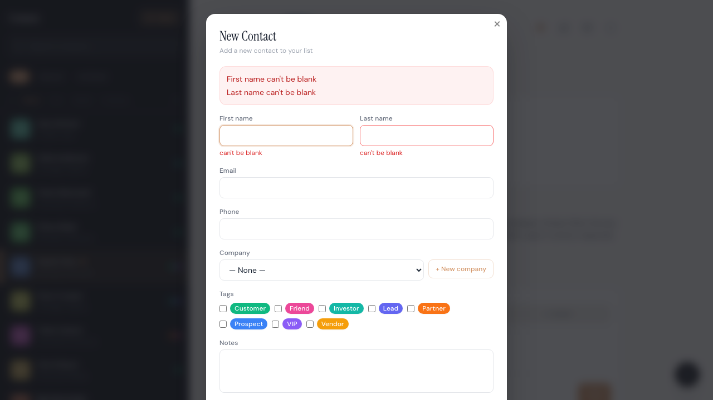
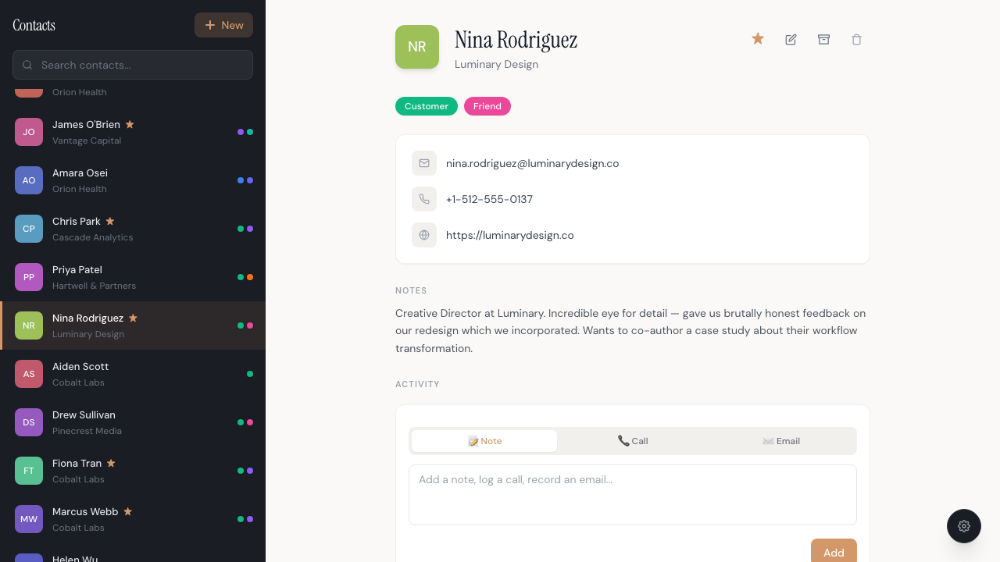

# Unpoly Contact Manager

> A production-quality Rails contact manager — no React, no JSON API, no build step.
> Server-rendered HTML all the way. [Unpoly 3](https://unpoly.com) handles the rest.


---

## Live Demo

<a href="https://unpoly-contact-manager-demo.fly.dev" target="_blank">→ unpoly-contact-manager-demo.fly.dev</a>

The first request may take 1–2 seconds. The app runs on Fly.io with `auto_stop_machines = "suspend"` — it suspends when idle and wakes on the next request by restoring a memory snapshot. Subsequent requests are instant.

**The database is reset to seed data every hour.** Feel free to create, edit, and delete contacts — it's a sandbox.

**Deployment cost breakdown:**

| Resource | Spec | Cost |
|---|---|---|
| Machine | 2 shared vCPUs, 512 MB RAM | Pay-per-second while running (~$5–7/month at full uptime) |
| Volume | 1 GB SQLite database | $0.15/month (fixed) |

The machine is only billed while actively handling requests. In suspend mode, a low-traffic demo runs a small fraction of the month, so the machine cost is well under the full-uptime figure. The volume is the only fixed charge.

---

## What is this?

A full-featured contact manager that demonstrates **15 real-world Unpoly patterns** in a single Rails app:

- **Fragment updates** — click a contact, only the right panel re-renders
- **Instant navigation** — responses feel immediate with preloading and `up-instant`
- **Modal overlays** — create and edit contacts without leaving the list
- **Nested subinteractions** — create a company from inside the contact form
- **Live search** — the list filters as you type, 300 ms debounced, without losing focus
- **Per-field validation** — server-side errors appear inline, on blur
- **Optimistic UI** — star and archive respond immediately; server confirms
- **Lazy loading** — the activity timeline loads after the main panel settles
- **Flash messages** — appear across fragment updates without a full page load
- **Dark mode** — persisted in `localStorage`, applied before paint

No webpack. No Node. No TypeScript. Everything is HTML, rendered by Rails.

---

## Screenshots

### Two-panel layout — click a contact, only the right panel updates

The classic master/detail pattern. The left sidebar never re-renders during navigation.
The URL updates, the browser history is correct, the back button works.

```erb
<%= link_to contact_path(contact),
      "up-target"  => "#contact-detail",
      "up-history" => "true",
      "up-alias"   => "/contacts/*",
      "up-preload" => "",
      "up-instant" => "" do %>
  ...
<% end %>
```

- `up-target` — only replace `#contact-detail`, leave the sidebar alone
- `up-alias` — mark the sidebar links as "active" when any `/contacts/*` URL is open
- `up-preload` + `up-instant` — start fetching on hover; follow on mousedown instead of mouseup

### Live search — only the list fragment updates, search box keeps focus



```erb
<%= f.search_field :q,
      "up-autosubmit"  => "",
      "up-watch-delay" => "300" %>
```

The search field is **outside** `#contacts-list` so it survives fragment swaps. An `up.compiler` keeps a hidden filter field in sync so filter tabs and search compose correctly.

### Filter tabs — starred contacts



Clicking **Starred** replaces `#contacts-list` with filtered results. The URL updates (`?filter=starred`). The search form's hidden field is kept in sync by `up.compiler` so both filters compose without server-side gymnastics.

---

### Modals — create and edit without leaving the list

**New contact** opens in a modal overlay. Submit closes the modal and refreshes both the list and the detail panel — the contact appears selected and scrolled into view.



**Edit contact** opens another modal on top of the detail view. Save closes it and re-renders just the contact info section.



Both use the same pattern:

```erb
<%= link_to new_contact_path,
      "data-overlay-link" => "",
      "up-on-accepted" => "up.render({ target: '#contact-detail', url: event.value }); up.reload('#contacts-list')" %>
```

A `[data-overlay-link]` macro resolves at runtime to `up-layer="new modal"` or `up-layer="new drawer"` depending on the user's stored preference. Switching between the two is one line of JavaScript.

On the server, accepting the overlay is clean:

```ruby
# contacts_controller.rb
if @contact.save
  if up.layer.overlay?
    up.layer.accept(contact_path(@contact))  # sends X-Up-Accept-Layer header
    head :no_content
  else
    redirect_to contact_path(@contact)
  end
end
```

---

### Nested subinteraction — create a company from inside the contact form



The "+ New company" link inside the contact form opens a **second modal on top of the first**. When you create the company and that modal closes, its value (the new company's ID) is injected directly into the parent form's select dropdown. The contact form never re-renders.

```erb
<%= link_to new_company_path,
      "up-layer"       => "new modal",
      "up-on-accepted" => "up.validate(this.closest('form'))" %>
```

```ruby
# companies_controller.rb
if @company.save
  up.layer.accept(@company.id)  # passes the ID back to the parent layer
  head :no_content
end
```

---

### Per-field validation with `up-validate`



Add `up-validate` to the form tag. On blur, Unpoly sends the field value to the server, which re-renders the form with errors. Only the changed field triggers the round-trip.

```erb
<%= form_with url: contacts_path, html: { "up-validate" => "" } do |f| %>
```

```ruby
# controller — handles both validation and regular submission
if up.validate?
  @contact.valid?
  render :new, status: :unprocessable_entity and return
end
```

> **Rails 8 gotcha:** `form_with` silently drops Unpoly attributes passed as keyword args.
> Always use `html: { "up-validate" => "" }` — the `html:` option is required.

---

### Optimistic UI — star and archive respond before the server

The star button toggles immediately. If the server fails, Unpoly rolls it back.

```js
// application.js
up.preview('toggle-star', function(preview) {
  let indicator = preview.fragment
  let wasStarred = indicator.classList.contains('starred')
  preview.addClassTemporarily(indicator, wasStarred ? 'unstarred' : 'starred')
  preview.removeClassTemporarily(indicator, wasStarred ? 'starred' : 'unstarred')
})
```

```erb
<%= button_to star_contact_path(contact), method: :patch,
      "up-preview" => "toggle-star",
      "up-target"  => "#contact-detail" %>
```

Archive fades the row immediately:

```js
up.preview('archive-contact', function(preview) {
  let row = preview.origin.closest('.contact-row')
  if (row) preview.setStyleTemporarily(row, { opacity: '0.3', pointerEvents: 'none' })
})
```

---

### Lazy loading — activity timeline loads after the main panel



The detail panel renders instantly with a spinner in the activity section.
Unpoly fetches the timeline in a separate request after the main content is displayed.

```erb
<%# In _contact_detail.html.erb %>
<div id="activities-panel"
     up-defer
     up-href="<%= contact_activities_path(contact) %>">
  <div class="animate-spin ..."></div>
</div>
```

```erb
<%# In activities/index.html.erb — must wrap in the same ID %>
<div id="activities-panel">
  <%= render @activities %>
</div>
```

---

### Dark mode


Persisted in `localStorage`. Applied before first paint via an inline script in `<head>` to prevent flash. Toggled via the Settings button.

---

## Why Unpoly?

Most SPAs solve one problem — faster page transitions — and bring enormous complexity in return: a build pipeline, client-side routing, two rendering environments, JSON endpoints, and state management layered on top of the database state you already have.

Unpoly takes a different path. You keep writing normal Rails views. Unpoly progressively enhances them: fragment updates, overlays, form validation, optimistic UI, lazy loading — all from HTML attributes. **No framework. No API layer. No build step.**

The result is a codebase that a Rails developer can read completely. Every feature lives in one place: the server-rendered view and a standard controller action.

---

## 15 Unpoly Features Demonstrated

| # | Feature | Where | Attribute / API |
|---|---------|--------|-----------------|
| 1 | **Fragment update** | Click a contact row | `up-target="#contact-detail"` |
| 2 | **Preload on hover** | Contact rows | `up-preload` |
| 3 | **Instant navigation** | Contact rows | `up-instant` |
| 4 | **URL alias** | Active sidebar link | `up-alias="/contacts/*"` |
| 5 | **Live search** | Search box | `up-autosubmit`, `up-watch-delay` |
| 6 | **New contact modal** | "+ New" button | `up-layer="new modal"`, `up-on-accepted` |
| 7 | **Edit modal** | Edit button | `up-layer="new modal"`, `up-on-accepted` |
| 8 | **Per-field validation** | Contact form | `up-validate` on `<form>` |
| 9 | **Reactive select** | Company dropdown | `up-watch`, `up-target="#company-fields"` |
| 10 | **Nested subinteraction** | "+ New company" link | `up-layer="new modal"`, `up.layer.accept(id)` |
| 11 | **Lazy loading** | Activity timeline | `up-defer`, `up-href` |
| 12 | **Optimistic star toggle** | Star button | `up-preview="toggle-star"` |
| 13 | **Optimistic archive** | Archive button | `up-preview="archive-contact"` |
| 14 | **Hungry flash messages** | After mutations | `#flash[up-hungry]` |
| 15 | **Progress bar** | During navigation | `<up-progress-bar>` |

---

## Tech Stack

| | |
|--|--|
| **Backend** | Ruby on Rails 8.1, SQLite, Puma |
| **Frontend** | Unpoly 3 (importmap + jsDelivr CDN), Tailwind CSS (Play CDN) |
| **Gem** | [`unpoly-rails`](https://github.com/unpoly/unpoly-rails) for server-side helpers |
| **Seed data** | 30 contacts across 8 realistic companies with activities and tags |

No webpack. No Node.js build step. No JSON API.

---

## Quick Start

```bash
git clone https://github.com/thomasklemm/unpoly-contact-manager-demo
cd unpoly-contact-manager-demo

bundle install
bin/rails db:create db:migrate db:seed
bin/rails server
```

Open [http://localhost:3000](http://localhost:3000).

---

## What to Try

1. **Click a contact** — right panel updates, URL changes, no full reload
2. **Hover a row before clicking** — it preloads silently (watch the Network tab)
3. **Type in search** — list filters after 300 ms; focus never leaves the input
4. **Click "+ New"** — modal appears over the list; submit closes it and the contact appears selected
5. **Click "Edit"** — modal opens on top of the detail; save closes it and refreshes only the contact info
6. **Click ★** — icon toggles immediately (optimistic); server confirms in the background
7. **Click Archive** — confirmation dialog; row fades out at once; server confirms
8. **Open the Activity section** — it lazy-loads after the main panel settles
9. **Create a contact → click "+ New company"** — a second modal opens; create the company; it appears in the dropdown of the first modal
10. **Open Settings** — switch between modal and drawer overlay style

---

## Project Structure

```
app/
  controllers/
    contacts_controller.rb    # index, show, new, create, edit, update, destroy, star, archive
    companies_controller.rb   # new, create (modal subinteraction)
    activities_controller.rb  # index, create (lazy-loaded timeline)
  models/
    contact.rb                # validations, scopes (active/starred/archived)
    company.rb
    tag.rb / contact_tag.rb
    activity.rb
  views/
    contacts/
      index.html.erb           # two-panel shell: #contacts-sidebar + #contact-detail
      _contacts_list.html.erb  # filter tabs + rows fragment
      _contact_row.html.erb    # up-target, up-preload, up-instant, up-alias
      _contact_detail.html.erb # star, archive, delete, lazy activities
      _form.html.erb           # up-validate, reactive select, subinteraction link
    companies/
      new.html.erb             # modal form; accepts with company ID
    activities/
      index.html.erb           # timeline + inline add form (lazy via up-defer)
  javascript/
    application.js             # Unpoly config, preview definitions, up.compiler()s
```

---

## Server-Side Helpers (`unpoly-rails`)

The `unpoly-rails` gem adds request-aware helpers to controllers and views:

```ruby
# Is this an Unpoly fragment request?
up?

# Handle per-field validation (triggered by up-validate)
if up.validate?
  @contact.valid?
  render :new, status: :unprocessable_entity and return
end

# Accept a modal overlay — closes it on the client with a return value
if up.layer.overlay?
  up.layer.accept(contact_path(@contact))
  head :no_content
end

# Expire the client-side cache after mutations
up.cache.expire("/contacts*")
```

---

## Tests

```bash
# All tests (unit + integration + system)
bin/rails test:all

# System tests only (headless Chrome)
bin/rails test:system

# System tests in a visible browser window
HEADED=1 bin/rails test:system

# System tests with artificial server delay (shows progress bar and transitions)
DEMO_MODE=1 bin/rails test:system
```

---

## Claude Code Skills for Unpoly

This repo ships with two [Claude Code](https://claude.ai/code) agent skills that bring
Unpoly's full documentation into your AI coding sessions:

- **`unpoly`** — core Unpoly docs (fragments, overlays, forms, caching, previews, lifecycle)
- **`unpoly-rails`** — Rails integration (`up?`, `up.layer`, `up.validate?`, `up.cache`, etc.)

Install from [thomasklemm/unpoly-skills](https://github.com/thomasklemm/unpoly-skills):

```bash
git clone https://github.com/thomasklemm/unpoly-skills /tmp/unpoly-skills
mkdir -p .claude/skills
cp -r /tmp/unpoly-skills/unpoly       .claude/skills/
cp -r /tmp/unpoly-skills/unpoly-rails .claude/skills/
```

Then use them in Claude Code:

```
/unpoly How does up-defer work?
/unpoly-rails How do I expire the cache after a form submission?
```

---

## License

MIT
